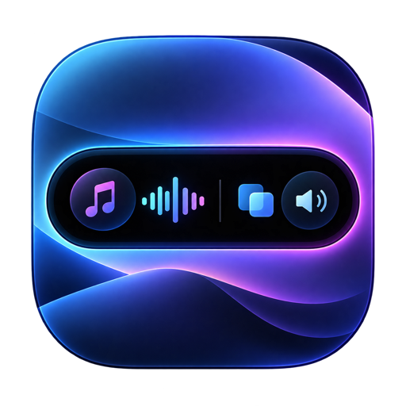
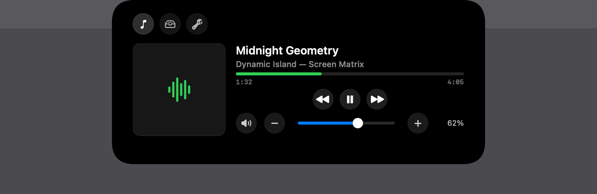
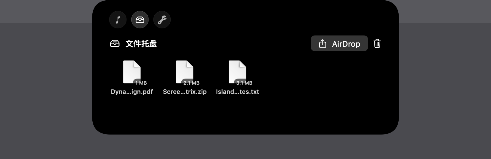
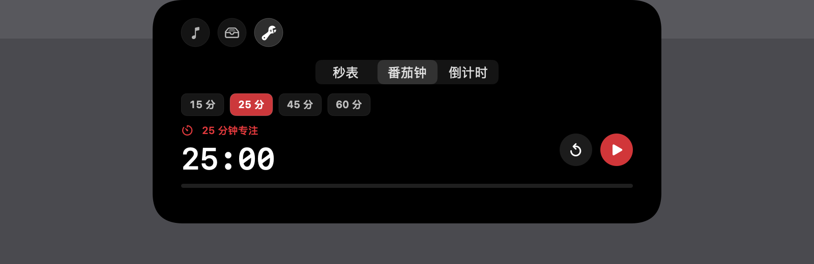

# Dynamic Island



[](https://github.com/qyt1340272051-design/DynamicIsland/actions/workflows/ci.yml)

一个贴合 Mac 刘海区域的开源 SwiftUI 菜单栏应用。通过无标题 `NSPanel` 在屏幕顶部提供系统音量、Apple Music、文件托盘、AirDrop 和计时工具，并在活动进行时保留紧凑状态提示。

> 当前版本为 `0.5.0`。GitHub Release 提供本地 ad hoc 签名、未经 Apple 公证的公开测试 DMG，不是 Developer ID 正式安装包。macOS 26.0 或更高版本首次运行时可能拦截；请核对来源和 SHA-256，仅在信任此包时按下方步骤手动批准。

## 界面预览

以下图片由工程的屏幕矩阵工具生成，展示模拟状态；不代表真实设备兼容性验收结果。完整截图位于 [`docs/images/`](docs/images/)。

### Apple Music



### 文件托盘与番茄钟

| 文件托盘 | 番茄钟 |
| --- | --- |
|  |  |

### 紧凑播放状态


## 当前功能

- 刘海顶部 `NSPanel`：悬停延迟展开、拖入文件展开、状态切换动画与触觉反馈。
- 系统音量：实时读取和调节默认输出设备音量，支持增减、滑杆与静音。
- Apple Music：读取封面、曲名、歌手和播放进度，支持播放、暂停、上一曲、下一曲和实时拖动进度条；悬停进度条时显示拖动圆点。
- 文件托盘：把拖入文件复制到沙盒临时目录，支持锁定展开、单项移除和清空，并通过系统 AirDrop 分享面板发送。
- 计时工具：通过闹钟图标选择秒表、多个番茄钟时段和可长按快速调节的倒计时；岛体随当前内容调整高度。
- 岛内退出：展开后可点击电源图标关闭应用。
- 紧凑活动态：音乐播放时显示微缩封面与六点动态指示，计时运行时显示功能图标和实时数据。
- 多屏适配：按当前屏幕、刘海安全区、菜单栏可见状态和显示器变化重新计算面板位置。
- 调试矩阵：内置模拟屏幕配置，可生成 8 种屏幕环境、8 种界面状态的 64 张快照。
- Beta 诊断：菜单栏可复制脱敏的设备、屏幕与面板信息，并直接打开结构化反馈表单。

## 环境要求

- macOS 26.0 或更高版本
- Xcode 26.6
- Swift 5

刘海 MacBook 是主要使用场景；无刘海内建屏幕和外接显示器也有对应的几何回退与模拟测试。

## 快速开始

可以从 [GitHub Releases](https://github.com/qyt1340272051-design/DynamicIsland/releases) 下载 `0.5.0` 测试 DMG，也可以克隆源码运行：

```bash
git clone https://github.com/qyt1340272051-design/DynamicIsland.git
cd DynamicIsland
open DynamicIsland.xcodeproj
```

在 Xcode 中选择共享 scheme `Dynamic Island`，目标选 `My Mac`，按 `Command-R`。应用使用 `LSUIElement` 作为菜单栏配件启动，不会显示普通主窗口。鼠标移入屏幕顶边的岛以展开；菜单栏图标提供显示、隐藏、诊断与退出。

详细操作见 [使用说明](docs/USAGE.md)；Xcode、命令行编译、测试和本地打包步骤见 [编译说明](docs/BUILDING.md)。

测试 DMG 的首次安装：下载后核对随附的 SHA-256，把 `Dynamic Island.app` 从 DMG 拖到“应用程序”，尝试打开。若 macOS 拦截，请在确认文件可信后前往“系统设置 > 隐私与安全性”，点击“仍要打开”，再确认“打开”。这是未公证构建的手动放行，不代表 Apple 已验证其安全性；具体步骤见 [Apple 官方说明](https://support.apple.com/zh-cn/102445)。受设备管理策略限制时可能无法放行。

命令行快速编译：

```bash
xcodebuild build \
  -project DynamicIsland.xcodeproj \
  -scheme 'Dynamic Island' \
  -configuration Debug \
  -destination 'platform=macOS'
```

## 权限说明

- **Apple Music 自动化**：首次读取或控制音乐时，macOS 会请求允许“Dynamic Island”控制“音乐”。拒绝后可前往“系统设置 > 隐私与安全性 > 自动化”重新开启。
- **用户选择的文件**：文件托盘使用沙盒的用户所选文件读写权限；导入内容会复制到应用临时托盘目录。
- **AirDrop**：分享由系统 `NSSharingService` 提供，实际可用性取决于当前 Mac 的 AirDrop 状态。

项目启用了 App Sandbox，只声明上述功能所需的文件和 Apple Events 权限。

## 工程结构

| 区域 | 主要文件 | 职责 |
| --- | --- | --- |
| 应用入口 | `DynamicIslandApp.swift` | 菜单栏生命周期、服务装配与 accessory 模式 |
| 面板 | `IslandPanelController.swift`、`IslandPanelGeometry.swift` | `NSPanel` 创建、命中区域、屏幕顶边定位和状态尺寸 |
| 状态 | `IslandViewModel.swift` | 展示状态、服务调用、悬停与活动态协调 |
| 界面 | `IslandView.swift`、`IslandTimerToolsView.swift` | 音乐、文件、音量、计时工具和紧凑态 UI |
| 系统服务 | `DynamicIsland/Services/` | CoreAudio、Apple Music、文件托盘、AirDrop 和触觉反馈 |
| 屏幕适配 | `ScreenManager.swift`、`ScreenEnvironment.swift` | 多屏选择、拓扑变化和模拟环境 |
| Beta 诊断 | `DynamicIsland/Diagnostics/` | 脱敏诊断报告、剪贴板与反馈入口 |
| 测试 | `DynamicIslandTests/` | 几何、状态机、系统服务适配和快照矩阵 |

## 验证

运行与 GitHub Actions 相同的完整测试和 Release 构建：

```bash
./Scripts/ci.sh
```

运行 Spaces、全屏、隐藏菜单栏、合盖和权限拒绝等稳定性场景：

```bash
./Scripts/run-stability-matrix.sh
```

生成屏幕快照矩阵：

```bash
./Scripts/generate-screen-matrix.sh
open artifacts/screen-matrix/index.html
```

生成的矩阵位于被 Git 忽略的 `artifacts/screen-matrix/`，不会污染提交。

## Beta 测试

真机公测计划覆盖有/无刘海、单/双屏、合盖外接、多种缩放以及 Apple Silicon/Intel；当前 `DI-B01` 至 `DI-B09` 均待验收。矩阵、测试步骤、隐私范围、`S0`–`S3` 问题分级与公测出口条件见 [Beta 验收手册](docs/BETA_TESTING.md)。

测试者可从菜单栏选择“复制调试信息”和“提交 Beta 反馈...”。调试报告不包含用户名、序列号、文件名或音乐元数据。

## 发布

本地可用下列命令构建通用架构测试 DMG、SHA-256 和 manifest：

```bash
./Scripts/release.sh --local
```

此包采用 ad hoc 签名，未经 Developer ID 签名或 Apple 公证，可作为明确标注风险的 GitHub 预发布测试包，但不能声称可无提示双击启动。`v*` Tag 的自动打包与预发布流程见 [发布指南](docs/RELEASING.md)。

## 已知限制

- 音乐集成目前只支持 macOS 自带的 Apple Music，不支持 Spotify 等第三方播放器。
- 秒表、番茄钟和倒计时状态不会跨应用重启恢复。
- 正式 Developer ID 签名与公证需要发布团队凭据；自动更新尚未实现。
- 屏幕模拟矩阵已覆盖常见几何组合；真机 Beta 矩阵的待验证项以 `docs/beta-device-matrix.json` 为准。

## 参与开发

提交改动前请阅读 [CONTRIBUTING.md](CONTRIBUTING.md)。Bug 报告、功能建议、屏幕兼容性和 Beta 验收都有对应的结构化 Issue 模板；Pull Request 会自动校验真机矩阵、执行测试和 Release 构建。

## 许可证

本项目使用 [MIT License](LICENSE)。
